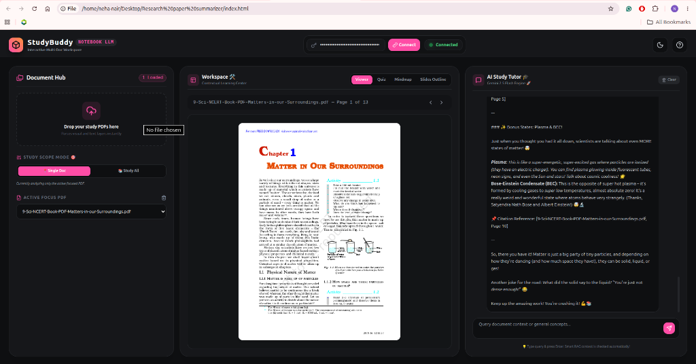
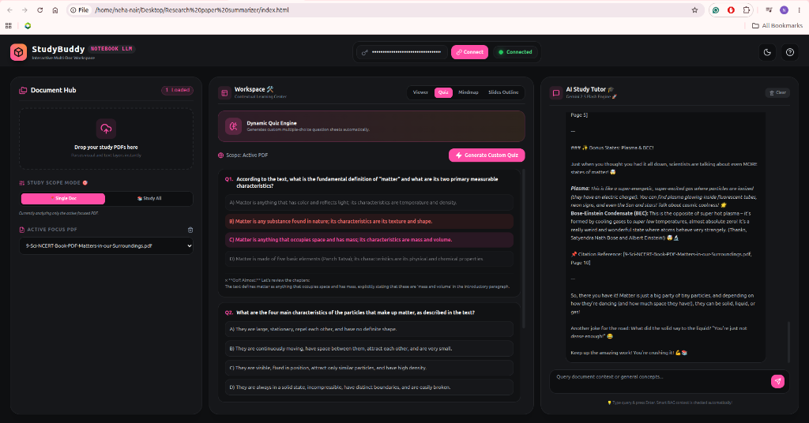
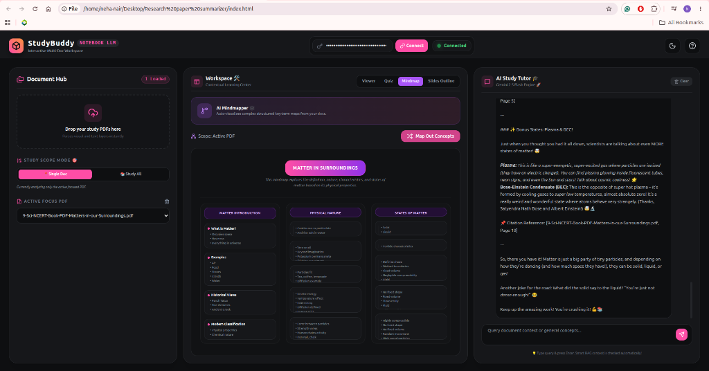

# StudyBuddy — Notebook LLM Studio 🎓⚡

> **Live Demo:** [study-buddy-umber-psi.vercel.app](https://study-buddy-umber-psi.vercel.app)

**StudyBuddy** is a modern, high-fidelity, interactive multi-document workspace designed for students and researchers. It allows you to upload study PDFs, parse them locally in your browser, and utilize the power of the Google Gemini API to generate dynamic quizzes, visual mindmaps, presentation outlines, and chat with an AI study tutor.

The application operates **fully client-side** using **Dexie.js (IndexedDB)** for local browser database persistence. Your documents, chat history, and API configurations remain private and stored directly on your machine.

---

## 📸 Visual Overview

### 🔍 Document Viewer & AI Study Tutor

### 📝 Dynamic Quiz Engine

### 🕸️ AI Mindmapper

---

## 🚀 Key Features

*   **📄 PDF Visual Canvas Renderer**: Upload textbooks, homework sheets, or research slides. Render pages visually exactly as they are without heavy server-side processing.
*   **💾 Dexie.js Browser Persistence**: Refresh the tab or close the browser without losing progress! Your PDFs, extracted text, and chat history are saved locally in the browser's IndexedDB.
*   **🎯 Dual Study Scope Modes**:
    *   *Single Doc Mode*: Keep the focus on one specific chapter or paper.
    *   *Study All Mode*: Merge knowledge across all uploaded documents for a comprehensive study session.
*   **🧠 AI Study Tutor**: Chat naturally with a Gemini-powered tutor. The tutor automatically reads relevant contexts from your documents and appends direct citations (e.g., `[Doc Name, Page X]`).
*   **⚙️ Advanced Study Tabs**:
    *   **Quiz Room 📝**: Generates custom multiple-choice sheets from your documents with explanations for correct/incorrect answers.
    *   **AI Mindmapper 🕸️**: Auto-visualizes complex concepts into structured hierarchical key-term maps.
    *   **Slide Planner 📊**: Outlines PowerPoint slidedecks page-by-page based on your study materials.
*   **🔑 API Key Security**: Enter your Google Gemini key to connect. Keys are persisted in your browser's local storage for automatic reconnection on startup.

---

## 🛠️ Technology Stack

1.  **Frontend Core**: HTML5, Vanilla JavaScript, and Tailwind CSS (via CDN).
2.  **Database**: Dexie.js (Developer-friendly wrapper for browser IndexedDB).
3.  **PDF Engine**: PDF.js (Client-side rendering and text layer extraction).
4.  **Icons**: Lucide Icons.
5.  **LLM Integration**: Google Gemini API (`gemini-2.5-flash` / `gemini-1.5-flash` fallback).

---

## 🏁 Getting Started

### Prerequisites
To use the AI-assisted tools, you will need a **Google Gemini API Key**. You can get one for free from the [Google AI Studio](https://aistudio.google.com/).

### Running the App
Since the app runs entirely in the browser, you don't need a complex server setup. 

1.  Clone this repository or download the files.
2.  Open `index.html` directly in any modern web browser (Chrome, Firefox, Edge, Safari, etc.).
3.  **Enter your API Key** in the top navigation panel and click **Connect**. A glowing green `Connected` badge will confirm authentication.
4.  Drag and drop your study PDFs into the **Document Hub** sidebar.
5.  Start learning!

---

## 🔒 Privacy & Security

*   **Local Processing**: PDF text extraction and rendering happen entirely in your local browser runtime.
*   **Secure API Calls**: The app communicates directly with Google's API endpoints. No intermediary backend servers store your data or API keys.
*   **Data Control**: All saved papers, chats, and keys can be cleared instantly using the **Clear** chat button, **Trash** document button, or by clearing your browser cache.
